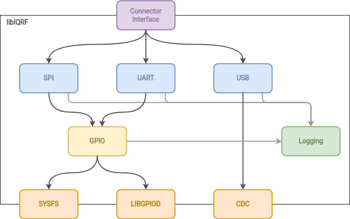

# libiqrf

[](https://gitlab.iqrf.org/open-source/iqrf-sdk/libiqrf/pipelines)
[](LICENSE)

## Description

This repository contains the IQRF libraries for C/C++.



### Libraries

- [`libiqrf-gpio`](src/gpio) - GPIO library
- [`libiqrf-log`](src/log) - Logging library

## Dependencies

- [CMake](https://cmake.org/) >= 3.5
- [Boost Filesystem](https://www.boost.org/doc/libs/1_74_0/libs/filesystem/doc/index.htm) >= 1.74.0
- [Ccache](https://ccache.dev/) >= 3.7 (optional)

### Testing
- [GTest](https://google.github.io/googletest/)

## Build

```bash
git clone https://gitlab.iqrf.org/open-source/iqrf-sdk/libiqrf.git
cd libiqrf/
mkdir build
cmake -Bbuild -H. -DCMAKE_BUILD_TYPE=Debug -DBUILD_STATIC=TRUE -DUSE_CCACHE=TRUE
cmake --build build
```

## Test

```bash
cd build/test/
ctest
```

